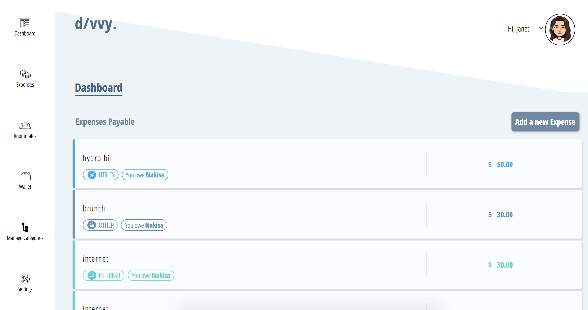
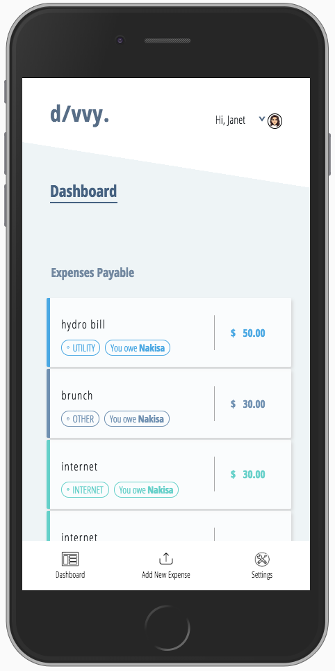

# Divvy

###### please note the navigation bar is a placeholder 

**To Start**
```
- clone
- npm install to install all the node modules
- requires 3 tabs on terminal: back-end, server, front-end

To start server:
- cd into 'divvy' folder
- in terminal, type: mongod --dbpath data/db

Back-end:
- cd into 'divvy' folder
- in terminal, type: node.js

Front-end:
- cd into 'client' folder in the divvy folder
- in terminal, type: npm start
```


**Premise**

Keep tabs on your household expenses with your roommates in a hassle-free and interactive way.  


**Description**

Managing household expenses (e.g. rent, groceries) with roommates is difficult and can get complicated. Divvy solves this issue by providing a space for roommates to communicate with each other to ‘divvy up’ the expenses in a hassle-free and interactive way. Upon log-in, the user is able to see an overview of the expenses and keep track of who owes what and any upcoming expenses. Divvy will send out a reminder at the end of each month of how much is owing (if there is no due date), and for any “future expenses”, it will send out a reminder a week before its due.


**Core Features**

1)	When logged in (assuming the user already registered), shows an overview of the user’s expenses – “dashboard”
- Upcoming bill due date
- How much is owing and to who 
- Summary of all the expenses
- A form to add a new bill 
- Name of the expense
- Description of expense
- How much it is (already divided up)
- Due date 
- Name of the user paid (payer)
- Name of the users being split with (“owers”)







**Stretch Features (to be added)**

1)	Register/Login system – Auth0
2)	Notification system 
- Sends out an email/text at the end of every month to remind users of what’s owing (using twilio for text)
- Sends out an email/text a week before a bill (e.g. rent) is due 
3)	A direct payment system
4)	Chat system
5)	Ability to add/delete users & edit/delete expenses


**User Stories**

Let’s say we have a user who’s not the most organized person when it comes to finances. They will be living with other people and wants to figure out a system to keep track of their common household expenses, such as rent, hydro, groceries, etc. Divvy is a perfect way to solve this issue!  The user is able to submit expenses they’ve already paid for (e.g. groceries), as well, set up fixed expenses (e.g. rent) with a due date. They’ll be able to see an overview of what she’s paid and what she’s owing. The user doesn’t need to set a reminder themselves, Divvy will automatically send out an email/text at the end of each month (for the expenses that were already paid), and send out an email/text a week before the bill is due (for any expenses with a due date).


**Tech-Stack**

Front-End: React, create-react-app, HTML/CSS/SCSS
UI Framework: React Router (NPM package)
Backend: Node/Express server, MongoDB (database)

**Description of Data**

The data is from the user’s input when adding a new bill. The form input will require the name of the item paid, price, payer, payee. 


## NOTE
- This is still a work-in-progress. 
### Next steps:
- Will be making the web application more responsive and accessible
- Will implement a notification system using node agenda and sendgrid

